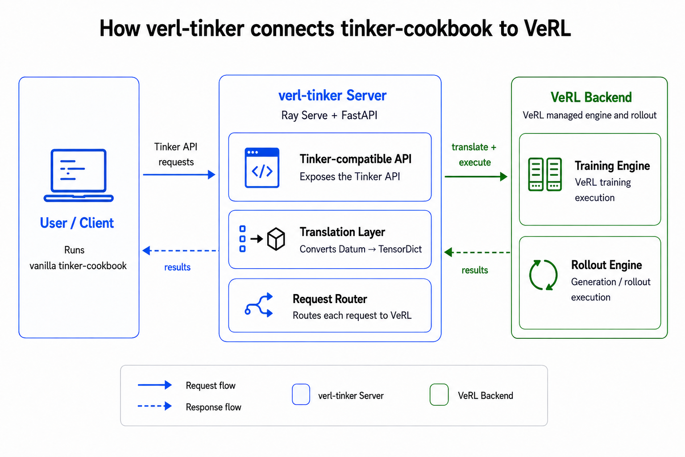

<p align="center">
  
</p>

# verl-tinker

<p align="center"><strong>Your Tinker loop, your GPUs.</strong></p>

<p align="center">
  Keep the Tinker Cookbook loop you know, and run SFT, RL, distillation,
  checkpointing, and rollout on verl-managed GPU workers you control.
</p>

<p align="center">
  <a href="https://verl-project.github.io/posts/2026-08-11-verl-tinker/">Announcement</a>
  &middot;
  <a href="configs/quick_start/">Quick-start configs</a>
  &middot;
  <a href="client_examples/">Client examples</a>
</p>

`verl-tinker` is a FastAPI/Ray Serve gateway that exposes Tinker-compatible
endpoints backed by verl actors. Existing Tinker SDK and Tinker Cookbook code
can keep its experiment loop and move distributed execution onto infrastructure
you operate. The client environment needs only Tinker and the Cookbook; the
server environment owns verl, VeOmni or FSDP execution, vLLM rollout, model
state movement, offload, and checkpoint storage.

This is a thin compatibility and routing layer, not a new training engine. It
translates Tinker requests into verl operations and returns Tinker-compatible
results. The server owns one global model, optimizer, session, and sampler
state, so deploy one server per active training client. It does not provide
isolated multi-client tenancy.

## News

- 2026-08-18: Added LoRA training support.
- 2026-08-11: Published [Introducing verl-tinker: Your Tinker loop, your
  GPUs](https://verl-project.github.io/posts/2026-08-11-verl-tinker/).
- 2026-07-24: Added frozen teacher models for OPD workflows.
- 2026-07-04: Released `verl-tinker`.

## Architecture

<p align="center">
  
</p>

A deployment has three independently managed parts:

1. **Client:** vanilla Tinker SDK or Tinker Cookbook code builds data, requests
   samples or log probabilities, submits loss-bearing batches, and advances the
   optimizer.
2. **Gateway:** Ray Serve and FastAPI expose the Tinker HTTP surface, translate
   Tinker `Datum` payloads to verl `TensorDict` batches, route operations, and
   track asynchronous request IDs and model versions.
3. **Backend:** verl manages distributed actor, rollout, reference, and optional
   frozen-teacher workers. The selected YAML controls model paths, parallelism,
   placement, offload, inference capacity, and checkpoint storage.

The client and server are deliberately separate environments. You can iterate
on a Cookbook recipe without installing the training stack in the client, while
the server can be sized and scheduled independently on a local or existing Ray
cluster.

## Install

The packaged server environment targets Linux x86-64 and Python
`>=3.12,<3.13`. It resolves a pinned PyTorch 2.11/CUDA 13 stack, so install it
on the GPU hosts that will run the Ray workers. Before deploying, ensure that:

- model paths or caches are readable from every node that may host a worker;
- the checkpoint directory is writable and backed by persistent storage if
  checkpoints must survive node replacement;
- all nodes have enough GPUs for the tensor/data/pipeline parallelism and Ray
  placement groups in the selected config; and
- the server port is reachable from the client but not exposed to an untrusted
  network (the current API key is a compatibility value, not authentication).

Run the installer from the root of `verl-recipe`:

```bash
# Install the full server runtime for this recipe.
./install_verl.sh --recipe verl_tinker
```

`install_verl.sh` reads `verl_tinker/REQUIRED_VERL.txt` and runs the recorded
install command. For this recipe, that command is `uv sync --project
verl_tinker --python python3.12`, so the server package and its runtime
dependencies are resolved together. Use `--show` to inspect it first:

```bash
./install_verl.sh --recipe verl_tinker --show
```


## Choose a config

Quick-start configs are under `verl_tinker/configs/quick_start/`.

| Config | Workers | Use it for |
| --- | --- | --- |
| [`actor.yaml`](configs/quick_start/actor.yaml) | Actor | SFT or optimizer-only workflows that never call `asample` |
| [`actor_rollout.yaml`](configs/quick_start/actor_rollout.yaml) | Actor + vLLM rollout | Sampling, SFT + RL, and RL without a reference worker |
| [`actor_rollout_ref.yaml`](configs/quick_start/actor_rollout_ref.yaml) | Actor + vLLM rollout + reference | RL workloads that request reference log probabilities for KL penalties |

The advanced configs are deployment templates rather than generic defaults:

| Config | What it demonstrates |
| --- | --- |
| [`actor_rollout_with_profiler.yaml`](configs/advance/actor_rollout_with_profiler.yaml) | Actor torch profiling with Chrome traces |
| [`gpt_oss_20b_actor_rollout.yaml`](configs/advance/gpt_oss_20b_actor_rollout.yaml) | FSDP actor + rollout functional setup for GPT-OSS 20B |
| [`gpt_oss_120b_actor_rollout.yaml`](configs/advance/gpt_oss_120b_actor_rollout.yaml) | Multi-node VeOmni/MoE setup for GPT-OSS 120B; the template requires 32 H100 GPUs |
| [`qwen3_1b7_actor_rollout_vexact.yaml`](configs/advance/qwen3_1b7_actor_rollout_vexact.yaml) | Qwen3-1.7B with the VeXact rollout path on Hopper GPUs |
| [`qwen3_8b_actor_rollout_lora.yaml`](configs/advance/qwen3_8b_actor_rollout_lora.yaml) | FSDP LoRA actor with synchronized vLLM adapter weights |
| [`qwen3_1b7_actor_qwen3_30b_a3b_teacher.yaml`](configs/advance/qwen3_1b7_actor_qwen3_30b_a3b_teacher.yaml) | One-node, eight-GPU actor + frozen-teacher distillation topology |
| [`qwen3_8b_actor_qwen3_32b_qwen3_235b_teachers.yaml`](configs/advance/qwen3_8b_actor_qwen3_32b_qwen3_235b_teachers.yaml) | Two-node, 16-H100 actor + dedicated multi-teacher topology |

Read the resource comments at the top of an advanced config before adapting it.
Model size alone does not determine whether it fits: account for training
parameters, optimizer state, rollout KV cache, reference/teacher replicas, and
temporary log-probability buffers.

Common environment overrides (override when you want your custom workflow):

```bash
export TINKER_SERVER_MODEL_NAME=Qwen/Qwen3-1.7B
export TINKER_SERVER_MODEL_PATH=/mnt/models/Qwen3-1.7B
export TINKER_SERVER_N_GPUS_PER_NODE=8
export TINKER_SERVER_PORT=8000
export TINKER_CHECKPOINT_DIR=/tmp/tinker-checkpoints
```

For an existing Ray cluster, set `RAY_ADDRESS`; otherwise the server starts a
local Ray runtime. `TINKER_SERVER_MODEL_NAME` is the identifier presented to
clients; `TINKER_SERVER_MODEL_PATH` is the weight location loaded by workers.
They may differ when serving a locally mounted model under its public name.


## Start the server

Start the server from inside the `verl_tinker` recipe directory. The config
paths below are relative to that directory:

```bash
cd verl_tinker
```

Actor + rollout:

```bash
python -m verl_tinker.start --config configs/quick_start/actor_rollout.yaml
```

Actor only:

```bash
python -m verl_tinker.start --config configs/quick_start/actor.yaml
```

Actor + rollout + reference:

```bash
python -m verl_tinker.start --config configs/quick_start/actor_rollout_ref.yaml
```

Wait for readiness:

```bash
curl http://127.0.0.1:8000/api/v1/healthz
```

Expected ready response:

```json
{"status": "ready"}
```

Stop the server:

```bash
curl -X POST http://127.0.0.1:8000/api/v1/shutdown
```

### Deployment and operations notes

- The start process is the Ray Serve supervisor and should be managed as a
  long-running service. `SIGTERM`, `Ctrl-C`, the shutdown endpoint, or
  `TINKER_SERVER_MAX_RUNTIME` initiate shutdown.
- Readiness means `/api/v1/healthz` returns `{"status":"ready"}`. Do not send a
  workload merely because the TCP port is open; actor and rollout initialization
  may still be in progress.
- The default host is `0.0.0.0`. Put the service behind your own authenticated
  network boundary or reverse proxy for any non-local deployment. The
  compatibility API key and shutdown endpoint assume a trusted environment.
- `TINKER_SERVER_MAX_CONCURRENT_SAMPLES` limits sampling concurrency at the
  server boundary. Tune it together with vLLM `max_num_seqs`, batched-token
  limits, GPU memory utilization, and client-side concurrency.
- With `server.enable_offload=true`, verl-tinker owns the model
  offload/onload lifecycle and disables conflicting per-worker verl offload
  switches during config processing.
- On a multi-node cluster, start and validate Ray first, set `RAY_ADDRESS` to
  that cluster, and launch exactly one verl-tinker server driver for the
  training client.


## Use a Tinker client

Point the client process at the server:

```bash
export TINKER_BASE_URL=http://127.0.0.1:8000/
export TINKER_API_KEY=tml-verl-tinker-local
```

The API key is a compatibility value; the current server accepts keys that start
with `tml`.

Then run normal Tinker or Tinker Cookbook code. For example:

```python
import os
import tinker

os.environ["TINKER_BASE_URL"] = "http://127.0.0.1:8000/"
os.environ["TINKER_API_KEY"] = "tml-verl-tinker-local"

client = tinker.ServiceClient(base_url=os.environ["TINKER_BASE_URL"])
```

## Sampling clients and resources

A `SamplingClient` points to a weight version; it does not create a model copy.
Verl-tinker can serve it only while the required weights exist in the actor,
rollout, reference policy, or a teacher.

| Requested operation | Resource that can serve it |
| --- | --- |
| Generate from current actor weights | A synchronized rollout |
| Generate from frozen/base weights | A rollout still holding those weights, or a teacher |
| Scalar prompt log probabilities from current weights | A matching rollout or actor |
| Scalar prompt log probabilities from base weights | A reference policy, or LoRA with adapters disabled |
| Top-K prompt log probabilities | A matching rollout or teacher with sufficient `max_logprobs` |
| Use an older actor version | Only while the single rollout still holds it |

Actor and reference fallbacks support only scalar prompt log probabilities:
`num_samples=1`, `max_tokens=1`, `prompt_logprobs=true`, and no top-K. For more
functionality, provision the matching resource: a rollout for current-weight
generation, a reference policy or LoRA for base-model log probabilities, or a
teacher for frozen-model generation and Top-K log probabilities. These require
the corresponding GPU memory and inference capacity.

### Server-configured custom loss

The five Tinker-native wire losses are `cross_entropy`,
`importance_sampling`, `ppo`, `cispo`, and `dro`. Verl-tinker additionally
accepts `custom_from_config` on `forward_backward`:

```python
future = training_client.forward_backward(
    data,
    loss_fn="custom_from_config",  # type: ignore[arg-type]
)
```

This extension ignores `loss_fn_config` and runs the request with the complete
`actor_rollout_ref.actor` loss configuration supplied when the server started.
The type-ignore is needed because the upstream Tinker SDK's `LossFnType` does
not include verl-tinker's extension, although its runtime request serializer
preserves the string.

This is separate from Tinker's `forward_backward_custom`, which evaluates a
Python loss function in the client and sends `cross_entropy` forward/backward
requests to the server. Verl-tinker currently supports that SDK helper only
for 1-D `target_tokens`; multi-target custom losses are rejected before engine
execution.


## Run the included client examples

The examples intentionally use a separate client environment, because real
Tinker clients do not need the server package or core VeRL installed. Open a
separate shell, change into the client examples directory, and run the client
commands from there:

```bash
cd verl_tinker/client_examples
uv sync

uv run run_single_test.py \
  --base-url http://127.0.0.1:8000/ \
  --test-name sft_tulu3
```

Available `--test-name` values are documented in
`verl_tinker/client_examples/README.md`.

## API Surface

Compatibility and lifecycle:

- `GET /api/v1/healthz`
- `POST /api/v1/shutdown`
- `GET|POST /api/v1/get_server_capabilities`
- `POST /api/v1/client/config`
- `POST /api/v1/telemetry`

Session/model metadata:

- `POST /api/v1/get_info`
- `POST /api/v1/create_session`
- `GET /api/v1/sessions/{session_id}`
- `POST /api/v1/sessions`
- `POST /api/v1/create_model`
- `POST /api/v1/create_sampling_session`
- `GET /api/v1/samplers/{sampler_id}`
- `POST /api/v1/session_heartbeat`

Training, sampling, and checkpoint operations:

- `POST /api/v1/forward`
- `POST /api/v1/forward_backward`
- `POST /api/v1/optim_step`
- `POST /api/v1/save_weights_for_sampler`
- `POST /api/v1/save_weights`
- `POST /api/v1/load_weights`
- `POST /api/v1/weights_info`
- `POST /api/v1/export_model`
- `POST /api/v1/asample`
- `POST /api/v1/retrieve_future`

Most long-running operations return a `request_id`. Poll
`/api/v1/retrieve_future` with that ID until the result is available.

## Torch Profiler

`verl_tinker` reuses verl's worker profiler. To capture a Chrome trace for
actor `forward_backward`, set `global_profiler.tool=torch`, choose the Tinker
training request numbers to profile, and configure the actor profiler contents:

```yaml
global_profiler:
  tool: torch
  steps: [1]
  save_path: outputs/profile

actor_rollout_ref:
  actor:
    profiler:
      tool_config:
        torch:
          contents: [cuda, cpu]
```

If `global_profiler.tool` is set and `actor_rollout_ref.actor.profiler.enable`
is not explicitly configured, the server enables actor profiling during config
processing. Trace files are written under `global_profiler.save_path`.

## Validate a Config

Validate a config and print the final processed YAML without starting Ray or
requesting GPU resources:

```bash
cd verl_tinker
python -m verl_tinker.config_utils --config configs/quick_start/actor.yaml
```

The command exits successfully after printing the config, or raises an error
when loading, interpolation, processing, or validation fails.

## Limitations

- The server has one actor state and at most one active rollout version; logical
  clients are not isolated. Synchronizing new actor weights replaces the old rollout
  version, so sampling clients bound to it may become unavailable. Verl-tinker
  detects this and returns a conflict error rather than serving the wrong
  weights. See [Sampling clients and resources](#sampling-clients-and-resources).
- LoRA is configured server-side through VeRL's
  `actor_rollout_ref.model.lora` / `lora_rank` / `lora_adapter_path` settings;
  a client's `CreateModelRequest.lora_config` does not reconfigure the running
  engine. With LoRA enabled, scalar prompt-logprob sampling for the initial
  model evaluates the frozen base weights with the adapter disabled. It does
  not enable autoregressive base-model sampling after rollout weights diverge.

## Acknowledgement

Developed by the ByteDance AML/Seed Team.

Contributors: [Tianle Zhong](https://luosuu.github.io/)\*,
[Huaye Zeng](https://www.wyett-zeng.com/)\*, [Xibin Wu](https://github.com/wuxibin89/), Siping Tao, [Peng Wu](https://www.linkedin.com/in/pengwu22/), [Yifan Pi](https://www.linkedin.com/in/yifan-pi-519971187/), and [Xiao Yu](https://www.linkedin.com/in/fishx/).
